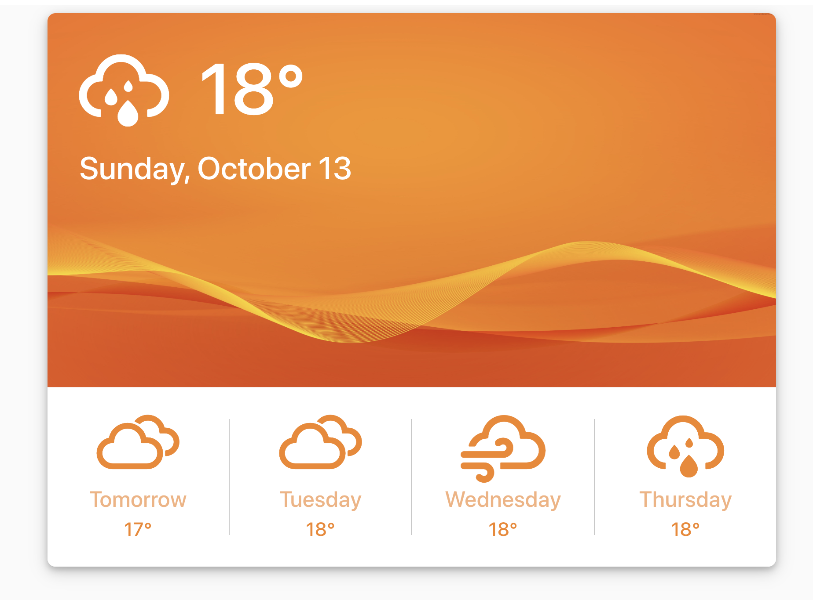

# Weather Dashboard

### Demo Link
https://herdmangct.github.io/weather-dashboard/

### Description
A simple weather widget that displays the next 5 days weather (using the [Open Weather Map API](https://openweathermap.org/api). Uses React Router so you can enter the name of a city in the url query parameter 'city' and receive the weather for that city. 

### How to run the app on your mac

- Download npm package manager
- clone the code from this repository
- type "npm install" to update the package manager
- type "npm start" to start the project on your local machine

### App Features

- Displays the weather for today and the next 4 days
- Displays an icon representing the current weather conditions
- Clean and simple design 
- Ability to enter the name of a city in the url query parameter 'city' and receive the weather for that city

### Future Improvements

- Better error validation and testing

### Technologies Used

- React 
- Bootstrap
- React Router
- axios
- OpenWeatherMap API
- [Weather Icons](https://erikflowers.github.io/weather-icons/)

### Author

Graham Herdman

## Create-React-App Stuff (Available Scripts)

In the project directory, you can run:

### `npm start`

Runs the app in the development mode. 
Open [http://localhost:3000](http://localhost:3000) to view it in the browser.

The page will reload if you make edits. 
You will also see any lint errors in the console.
